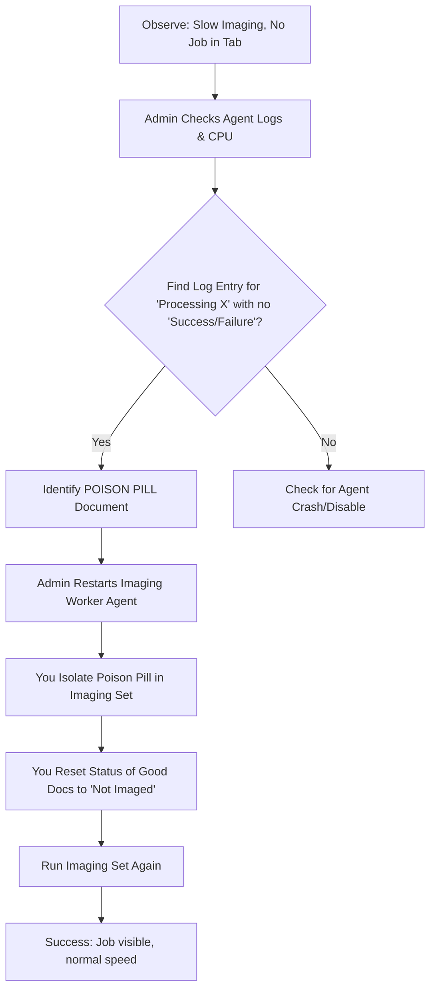

# **Step-by-Step Guide: Diagnosing and Fixing a "Poison Pill" Imaging Bottleneck**

**Objective:** Identify the single document (or few documents) consuming all resources and blocking the queue, then remove it to allow the rest to process normally.

**Notice:** There is two sections to this document, Poison Pill Diagnosis and Checking Server Performance below it.
---

### **Phase 1: Diagnosis (Identifying the Poison Pill)**

This phase requires **Relativity Administrator** assistance.

**Step 1: Check Agent Health and Resource Usage**
*   **Action:** Have your admin check the **Agent Manager** tab (`Admin` -> `Agents`).
*   **Goal:** Find the "Imaging Worker" agents. Check if any are:
    *   **Disabled** (needs to be enabled).
    *   **Has a "Last Update" time that is very old** (e.g., several hours ago). This indicates an agent that has crashed or is hung.
*   **Action:** Have your admin check the **server performance** (CPU and Memory) for the machines hosting the Imaging Workers.
*   **Goal:** Identify if one server is consistently at 95-100% CPU/Memory usage. This pinpoints which server is hosting the stuck process.

**Step 2: Find the Stuck Document in the Logs (The Key Step)**
*   **Action:** Have your admin access the **log files** for the Imaging Worker agent that is suspected to be hung (from Step 1).
*   **Goal:** Search the logs for entries from the time the slowdown started. Look for a log line that says:
    *   `Beginning to process document [Control Number]` or `Imaging document [Control Number]`
    *   ...that does **not** have a corresponding `Successfully processed` or `Failed to process` message later in the log.
*   **Result:** This document (`[Control Number]`) is your **"Poison Pill."** The agent is endlessly trying to process it.

**Step 3: Locate the Poison Pill in the Workspace**
*   **Action:** In your Relativity workspace, do a search for the Control Number identified in the logs.
*   **Goal:** Open the document and examine its **Native File Size** and **File Type**. It will almost certainly be abnormally large (e.g., hundreds of MBs) or a complex type (e.g., `.vsd`, `.xlsx`).

---

### **Phase 2: Resolution (Removing the Blockage)**

**Step 4: Restart the Imaging Worker Agent (Admin Action)**
*   **Action:** The admin must **restart** the hung Imaging Worker agent identified in Phase 1.
*   **Goal:** This kills the stuck process, frees up the server's resources, and allows the agent to start processing new tasks normally.

**Step 5: Prevent the Poison Pill from Re-Entering the Queue**
*   **Action:** You need to ensure the system does not try to image this document again.
    *   **Option A (Best):** Edit the **DataSource** (the saved search) of your Imaging Set to **exclude** the problematic document (e.g., by adding a condition like `Control Number` is not `[Poison Pill Control Number]`).
    *   **Option B (Quick):** Manually set the imaging status of the poison pill document to **Skipped** or **Error** using a Mass Operation or by editing the document directly. This flags it as "do not process."
*   **Goal:** The document is removed from the processing pipeline.

**Step 6: Reset the Queue for the Good Documents**
*   **Action:** The current "Pending" status for all other documents is now stale. You must reset it.
*   **Action:** Create a Saved Search for all documents in your Imaging Set where `Image Status` is `Pending`.
*   **Action:** Run a **Mass Operation** from this list: Choose **Set Image Status** -> **Not Imaged**.
*   **Goal:** This clears the old, stuck state and allows these documents to be picked up fresh by the now-healthy agents.

---

### **Phase 3: Retry**

**Step 7: Run the Imaging Set Again**
*   **Action:** Go to your Imaging Set and click **Run**.
*   **Expected Result:** The job should now appear in the **Jobs tab** and begin processing documents at a normal, fast rate. The poison pill has been removed, and the blockage is cleared.

### **Summary Flowchart for Clarity:**

Follow these steps in order. The most critical part is getting an administrator to help you with **Phase 1** to find the exact document causing the lock-up. Once you know that, the rest of the process is straightforward.

# **How to Check Server Performance**

**Goal:** Identify if a server is under extreme load (CPU at 100%).

**Tool:** Windows Task Manager. This is the quickest and easiest way.

**Steps:**
1.  **Remote Desktop (RDP)** into the server where the Imaging Worker agent is running. (If you have a multi-server environment, you may need to check several. Start with the Processing or Worker servers).
2.  Once logged in, press **Ctrl + Shift + Esc** to open **Task Manager**.
3.  Click on the **"Performance"** tab.
4.  Look at the **CPU** and **Memory** graphs.
    *   **If the CPU is consistently at or near 100%:** This is a strong sign that a process is stuck in a loop, consuming all resources. This is your "poison pill."
    *   **If Memory is maxed out:** The imaging process might be trying to load a massive file into RAM and failing.

**Pro Tip:** In Task Manager, click on the **"Processes"** tab and sort the list by **CPU** or **Memory** (click the column header). Look for processes with familiar names like `Foxit`, `Adobe`, `Excel`, or `Word`. The one at the top, consuming the most resources, is likely the culprit processing the problem document.

---

### 2. How to Access the Imaging Worker Log Files

**Goal:** Find the log file to identify the exact document the agent is stuck on.

**Location:** The logs are stored in a specific folder on the server where the Imaging Worker agent is installed. The default path is usually:
`C:\Program Files\relativity\Agents\Imaging Worker\Logs`

**Steps:**
1.  On the server, open **File Explorer** and navigate to the path above.
2.  The folder will contain multiple `.log` or `.txt` files, often with dates in the filename (e.g., `ImagingWorker_20241015.log`).
3.  Open the most recent log file in a text editor like **Notepad**.
4.  **How to read it:**
    *   Scroll to the **very bottom** of the file—this shows the most recent activity.
    *   Now, scroll *up* from the bottom, looking for the last entry that mentions a document.
    *   You are looking for a line that says something like:
        `[INFO] Beginning to image document [DOC-12345] (File: huge_spreadsheet.xlsx)`
    *   If you see a line like that and then **no subsequent message** saying it succeeded or failed, that document (`DOC-12345`) is almost certainly the "poison pill."

---

### 3. How to Restart the Imaging Worker Agent

**Goal:** Kill the stuck process to free up server resources.

**Method 1: Through the Relativity UI (Easiest & Preferred)**
1.  In your Relativity workspace, go to the **Admin** tab.
2.  Click on **Agent Manager**.
3.  Find the agent named **"Imaging Worker"** in the list. There may be several; they are often named with a number (e.g., `Imaging Worker 1`).
4.  Look at the **"Status"** column.
    *   If it says **"Enabled"** but has an old "Last Update" time, it's hung.
    *   **To restart it:**
        a. Click the checkbox next to the agent.
        b. Click the **Disable** button. Wait for the status to change to "Disabled."
        c. Click the checkbox again and click the **Enable** button. This fully restarts the agent.

**Method 2: Via Windows Services (Use if UI method fails)**
1.  On the server, press **Windows Key + R**, type `services.msc`, and press Enter.
2.  In the Services window, find the service named **`Relativity Imaging Worker Agent`** (or something very similar).
3.  Right-click on the service and choose **Restart**.
    *   If Restart is greyed out, choose **Stop**, wait for it to stop, then right-click and choose **Start**.

---

### Summary of Your Action Plan

1.  **RDP** into your Processing server.
2.  Open **Task Manager**. If CPU is at 100%, note which process is at the top.
3.  Navigate to `C:\Program Files\relativity\Agents\Imaging Worker\Logs`.
4.  Open the latest log file, scroll to the bottom, and find the last document it was trying to process. **Note the Control Number.**
5.  **Restart the agent** either through the Relativity Agent Manager (preferred) or Windows Services.
6.  Once the agent is restarted, go back to your workspace.
7.  Find the problematic document (using the Control Number from the logs) and either:
    *   **a)** Manually set its `Image Status` to `Skipped`.
    *   **b)** Edit your Imaging Set's search to **exclude** that specific Control Number.
8.  **Reset the queue:** Use a Mass Operation to set all other `Pending` documents in the set back to `Not Imaged`.
9.  **Re-run** the Imaging Set.

By following these steps, you will clear the blockage, and the imaging process should resume at normal speed. The key is finding that one stuck document through the logs.
